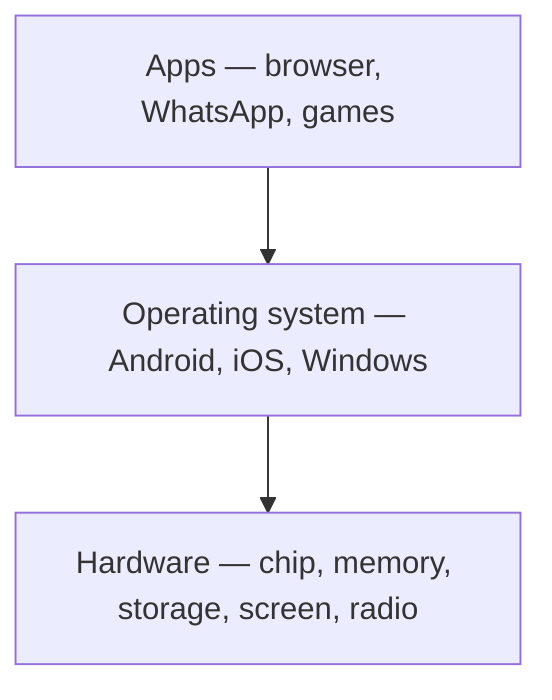
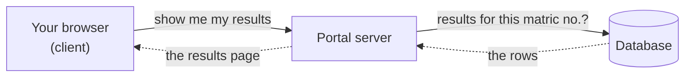
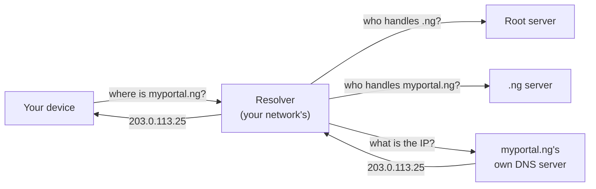

# Week 01 — Class Notes: How Computers & the Web Work

**100L · Semester 1 · Web Foundations & Developer Mindset · Shared by both tracks**

Today you'll find out what really happens when you open a website. Every app and site you build in this
programme happens inside the journey you learn today.

## How to use these notes

We go through these notes together on the projector. The tutor shows each step on screen while you do it
yourself. Every section follows the same pattern:

| Marker | What it means |
|---|---|
| **▶ Try it** | Something to do. Each step is marked with what you need: **(phone)**, **(laptop)**, **(paper)**, or **(watch)**, which means watch the tutor's screen. |
| **✓ What you should see** | How you can tell it worked |
| **? Check** | One question to answer before we move on. Open **Answer** afterwards to check yourself. |

- **No laptop or data?** Everything marked **(watch)** or **(paper)** works without either. Pair up with a
  neighbour for the rest.
- **Missed the session?** Work through these notes on your own. Every step tells you what you should see.

## By the end of today, you can…

1. Explain what a program is, and the difference between software and hardware.
2. Say whether something you do on your phone uses the Web, uses the Internet, or uses neither.
3. Point out who is asking and who is answering in any exchange online.
4. Explain why you can change what a website shows on your screen, but not what it stores.
5. Look up the IP address behind a domain name.
6. Read a status code and say whether the client or the server got something wrong.
7. Explain what HTTPS protects, and from whom.
8. Describe the full journey from typing an address to seeing the page.

---

## 1. Warm-up: Web, Internet, or neither?

People say "the internet" to mean almost anything done on a phone. Today you need to be more precise.

**▶ Try it (paper)**
1. Take out your **Today log** from the pre-read.
2. The tutor draws three columns on the board: **Web** · **Internet, not Web** · **Neither**.
3. Call out one item from your log, and say which column it goes in and why.

**✓ What you should see:** most items land in the first two columns. A few cause an argument, and that's
the point of the exercise.

**? Check:** Which column does a bank transfer by USSD code (`*xxx#`) go in?

<details><summary>Answer</summary>

**Neither.** USSD runs on the mobile network's own signalling channel. It works with zero data balance,
so it uses neither the Internet nor the Web. The **Internet** is the worldwide network that carries data
between computers. The **Web** is one service that runs on it: pages with addresses, linked to each other.
WhatsApp uses the Internet but isn't the Web.

</details>

---

## 2. A program is a list of exact instructions

A computer has no common sense. It does exactly what it is told, in order, and nothing else.

**▶ Try it (watch)**
1. A volunteer tells the tutor, step by step, how to soak a cup of garri.
2. The tutor does *exactly* what is said, using a cup, a bottle of water and a bowl.

**✓ What you should see:** sooner or later an instruction is too vague. For example, "pour the water"
without saying where. The tutor follows it literally, and it goes wrong.

That is programming. Four words you'll use all year:

| Word | Meaning |
|---|---|
| **Program** | A list of exact instructions |
| **Programming** | Writing those instructions precisely enough that nothing is left to guess |
| **Software** | Programs: things you can delete and reinstall |
| **Hardware** | The physical machine that carries the instructions out |

**▶ Try it (paper):** imagine you factory-reset your phone. In two lists, write what *survives* and what
is *gone*.

**✓ What you should see:** the screen, battery, camera and chips survive: that's hardware. The apps and
settings are gone: that's software.



**? Check:** Is a photo in your gallery hardware or software?

<details><summary>Answer</summary>

Neither: it's **data**. It is *stored on* hardware (the storage chip) and *shown by* software (the gallery
app). Like software, it disappears in a factory reset.

</details>

---

## 3. Who asks, who answers

We'll use one example for the rest of today: **checking your results on the student portal.**



- The program that asks is the **client**.
- The program that answers is the **server**.
- These are **roles**, not types of machine. The portal server is a *client* when it asks the database
  for your results.

A website splits its work into three jobs:

| | **Frontend** | **Backend** | **Database** |
|---|---|---|---|
| Runs on | *Your* device, in the browser | The school's server | The school's server |
| Job | Show the page, react to taps | Decide who you are and what you may see | Store the records |
| Who controls it | **You** | The school | The school |

**▶ Try it (laptop, or watch)**
1. Open any web page that shows a number, such as a price, a score or a date.
2. Press `F12`, or on a Mac `Cmd+Option+I`. This opens developer tools. Choose the **Console** tab.
3. **Type** this, then press Enter: `document.designMode = "on"`
   (Type it rather than pasting it; Chrome blocks pasting into the console until you allow it.)
4. Click on the number on the page and change it to anything you like.
5. Reload the page.

**✓ What you should see:** in step 4 the number changes on your screen. In step 5 the original comes back.

**? Check:** You just "changed" the page. Did the website's real data change? So who must decide your
CGPA?

<details><summary>Answer</summary>

No. You only changed **your copy** of the page, which is the frontend, and it runs on *your* machine.
Anything that must be trusted, such as grades, passwords, prices and permissions, is decided on the
**backend**, where users can't reach it. Week 2 builds on this.

</details>

---

## 4. Names and numbers: DNS

Your phone doesn't call "Mummy". It calls the number saved under that name. The Internet works the same
way:

- **IP address:** the number every reachable machine has, such as `203.0.113.25`
- **Domain name:** the human-friendly name, such as `developer.mozilla.org`
- **DNS** (Domain Name System): the shared contacts list that turns names into numbers

**▶ Try it (phone or laptop)**
1. Open <https://toolbox.googleapps.com/apps/dig/>
2. Type `developer.mozilla.org` and choose record type **A**.
3. Now try `this-name-does-not-exist.example`.

**✓ What you should see:**
- For `developer.mozilla.org`: one or more IP addresses, each four numbers separated by dots. You may
  also see a line pointing to another name first. That's an alias (a **CNAME**), and it's normal.
- For the made-up name: **NXDOMAIN**, meaning "no such domain". Remember this one. It is what is behind
  the browser error *"This site can't be reached."*

Nobody holds the whole contacts list. A lookup is passed along a chain of servers, each one saying "I
don't know, but ask them":



Answers are **cached**: remembered for a while, so most lookups never travel the whole chain.

**A website needs two separate rentals:**
- **A domain name**, rented yearly from a registrar. For `.ng` names, the national registry is NiRA.
- **Hosting**, a rented machine that is always on and always connected, running server software.

**? Check:** You bought a domain yesterday but haven't paid for hosting. What does someone see when they
visit it?

<details><summary>Answer</summary>

Either nothing loads, or they see the registrar's "parked domain" placeholder page. You own the *name*,
but there is no machine of yours to answer.

</details>

---

## 5. The conversation: HTTP

Once the browser knows the address, it sends a message in an agreed format called **HTTP**. A request
says what you want:

```http
GET / HTTP/1.1
Host: example.com
```

- `GET` means "give me".
- `POST` means "here's something for you", for example a filled-in form.

**▶ Try it (watch):** the tutor runs `curl -i https://example.com` in a terminal. (`curl` is a program
that sends a request without a browser. You'll use the terminal yourself in week 4.)

**✓ What you should see:**
1. A **status line**, such as `HTTP/2 200`.
2. **Headers**, information about the reply. For example, `content-type: text/html` means "this is a web
   page".
3. A **blank line**.
4. The **body**: the HTML, as plain text.

**▶ Try it (phone):** open <https://developer.mozilla.org/en-US/no-such-page>

**✓ What you should see:** a proper "Page not found" page. The server is working fine. Behind the scenes it
sent the status code **404**.

The first digit of a status code tells you who is responsible:

| Starts with | Means | Example |
|---|---|---|
| **2** | "Here you go." | `200 OK` |
| **3** | "It's moved, go there." | `301 Moved Permanently` |
| **4** | "*You* asked wrongly." | `404 Not Found` |
| **5** | "*I* broke." | `500 Internal Server Error` |

**? Check:** You just saw a "Page not found" page. Did the server break?

<details><summary>Answer</summary>

No. A 4xx code means the **client** asked for something that doesn't exist; the server answered
correctly. A broken server sends a 5xx code.

</details>

---

## 6. HTTPS: sealed and signed

| | HTTP | HTTPS |
|---|---|---|
| Like | A **postcard** | A **sealed envelope, plus an ID check** |
| Who can read it | Everyone who handles it on the way: the hostel Wi-Fi, the network provider… | Only you and the server |
| Can it be changed on the way? | Yes | No, tampering is detected |
| Proves who the server is? | No | Yes, with a **certificate** vouched for by an authority your browser already trusts |
| Usual port | 80 | 443 |

A **port** is a number that says which program on the machine a message is for.

**▶ Try it (phone or laptop)**
1. Open any site that starts with `https://`.
2. Tap or click the icon just left of the address.
3. Open the connection or security details.

**✓ What you should see:** a message like *"Connection is secure."* On a laptop you can also open the
certificate and see who it was **issued to** and who **issued** it.

**? Check:** On hostel Wi-Fi, you log in to the portal over HTTPS. Who can read your password?

<details><summary>Answer</summary>

**The portal can**, because it has to check your password. The Wi-Fi owner and everyone else in between
**cannot**: they can see *which site* you're talking to, but not what you send. HTTPS protects the journey,
not what happens at the destination.

</details>

---

## 7. The whole journey

Put it all together. This is what happens when you type `myportal.ng/results` and press Enter:

1. **DNS**: the browser finds the IP address for `myportal.ng`.
2. **Connect**: the browser opens a connection to that address, on port 443.
3. **Secure**: the server shows its certificate, the browser checks it, and they agree on encryption.
4. **Request**: the browser sends `GET /results`.
5. **Backend**: the server checks who you are, and asks the **database** for your results.
6. **Response**: the server replies `200 OK` with an HTML page. Big replies travel as many small numbered
   chunks called **packets**, which are put back in order when they arrive.
7. **More requests**: the HTML mentions a stylesheet, images and scripts. The browser requests each one
   separately.
8. **Build**: the browser turns all of it into the page you see.

**▶ Try it (laptop, or watch)**
1. Open <https://developer.mozilla.org/en-US/>
2. Open developer tools and choose the **Network** tab.
3. Reload the page.
4. Click the **first row**.

**✓ What you should see:**
- Dozens of rows, one for each request, for a single page.
- The first row is the HTML document, with status `200`.
- In its details, a **Remote Address**: the IP address the browser connected to.

**? Check:** A friend's browser says *"This site can't be reached. The server's DNS address could not be
found."* Which step failed?

<details><summary>Answer</summary>

**Step 1, DNS.** The name never became an address, so none of the later steps could happen. That is
the NXDOMAIN you saw in section 4. In the lab you'll diagnose eight more problems like this.

</details>

---

## Key words

| Word | Meaning |
|---|---|
| Client | The program that asks |
| Server | The program that answers |
| Frontend | The part of a site that runs on the user's device |
| Backend | The part that runs on the server and makes the decisions |
| Database | Where the records are stored |
| IP address | The number a machine is reached at |
| Domain name | The human-friendly name for an address |
| DNS | The system that turns names into IP addresses |
| HTTP | The agreed format for web requests and responses |
| HTTPS | HTTP, encrypted and with the server's identity checked |
| Status code | The three-digit result of a request: 2xx, 3xx, 4xx or 5xx |
| Port | Which program on a machine a message is for (443 for HTTPS) |
| Packet | A small numbered chunk of a larger message |
| Cache | A saved copy, reused instead of asking again |

## Questions people ask

<details><summary>Is "the cloud" a real place?</summary>

Yes: it means other people's computers, in buildings called data centres. "Hosting in the cloud" means
renting part of those machines.

</details>

<details><summary>What's the difference between Google and Chrome?</summary>

Chrome is a **browser**, a program on your device that acts as the client. Google Search is a **website**
that lists other websites. You can use either one without the other.

</details>

<details><summary>Why does a site load on my data but not on the hostel Wi-Fi?</summary>

The website is the same, but the route to it is different. The Wi-Fi network might block the site, or its
DNS resolver might be failing.

</details>

<details><summary>Who owns the Internet? Who owns the Web?</summary>

Nobody owns either. The Internet is thousands of networks that agree to carry each other's traffic.
Tim Berners-Lee invented the Web at CERN in 1989. Its rules, such as HTML, CSS and HTTP, are open standards
kept by public bodies such as W3C and WHATWG. Anyone can use them free, and new versions are designed not
to break old pages.

</details>

<details><summary>Is HTML programming?</summary>

Not by the garri test. HTML describes *what is on the page*, but it can't make decisions. JavaScript,
from Semester 2, can.

</details>

## Read more

- MDN: [How the web works](https://developer.mozilla.org/en-US/docs/Learn_web_development/Getting_started/Web_standards/How_the_web_works) ·
  [The web standards model](https://developer.mozilla.org/en-US/docs/Learn_web_development/Getting_started/Web_standards/The_web_standards_model) ·
  [How browsers load websites](https://developer.mozilla.org/en-US/docs/Learn_web_development/Getting_started/Web_standards/How_browsers_load_websites)
- MDN: [What is a domain name?](https://developer.mozilla.org/en-US/docs/Learn_web_development/Howto/Web_mechanics/What_is_a_domain_name) ·
  [What is a web server?](https://developer.mozilla.org/en-US/docs/Learn_web_development/Howto/Web_mechanics/What_is_a_web_server) ·
  [HTTP status codes](https://developer.mozilla.org/en-US/docs/Web/HTTP/Reference/Status)
- Flavio Copes: [HTTP course](https://flaviocopes.com/courses/http/), module 1 ·
  [Browser Internals: From a URL to a page](https://flaviocopes.com/courses/browser-internals/from-url-to-page/)
- The Valley of Code: [DNS](https://flaviocopes.com/dns/) · [What is a port](https://flaviocopes.com/ports/) ·
  [HTTP vs HTTPS](https://flaviocopes.com/http-vs-https/)

---

## For tutors

These notes are projected, so keep each section moving: **no more than two minutes of explanation,
then straight to ▶ Try it.** If the class is reading rather than doing, cut the talking.

### Session plan (3 h 30 min)

| Time | Block | Activity |
|---|---|---|
| 0:00–0:15 | Warm-up | Section 1. Also state the assessment rule, which the curriculum requires in week 1: from week 11, Git history is the evidence, and a project without a believable history does not pass. |
| 0:15–1:15 | Concept | Sections 2–7, about 10 minutes each |
| 1:15–1:25 | Break | Set the room up for the role-play |
| 1:25–3:05 | Lab | [`lab.md`](lab.md): Be the Web → What broke? → the diagram |
| 3:05–3:20 | Show & tell | Two students each show their Before sketch next to their final diagram |
| 3:20–3:30 | Ship | Hand in, preview week 2 |

### Prep checklist

- [ ] Projector laptop: a terminal with `curl` working, and browser tabs open on the
      [dig tool](https://toolbox.googleapps.com/apps/dig/) and on MDN.
- [ ] Props for the garri demo: a cup, a bottle of water, a bowl.
- [ ] **Offline fallback.** Screenshot these beforehand, in case the room has no connection:
  - the `curl -i` output
  - the dig results (the real name and the NXDOMAIN)
  - the Network panel
- [ ] The lab kit: see [`lab.md` → Kit](lab.md#kit).

### Running the demos

- **Garri (section 2).** Be strictly literal. If an instruction is ambiguous, act out the
  *wrong* meaning. Stop with a loud "error" when a step can't be done, for example "add sugar" when there's
  no sugar.
- **designMode (section 3).** Make sure students *reload* at the end. Seeing the original number come back
  is the lesson.
- **USSD reveal (section 1).** Students nearly always put USSD in the Web column. Let the class argue
  before you open the answer.
- **The check answers are collapsed.** Take answers from the room before you click **Answer**.
